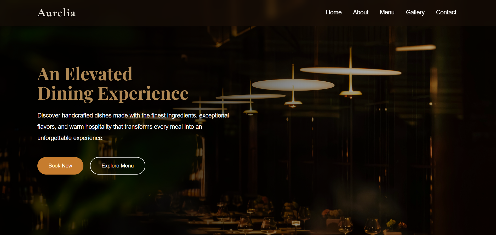
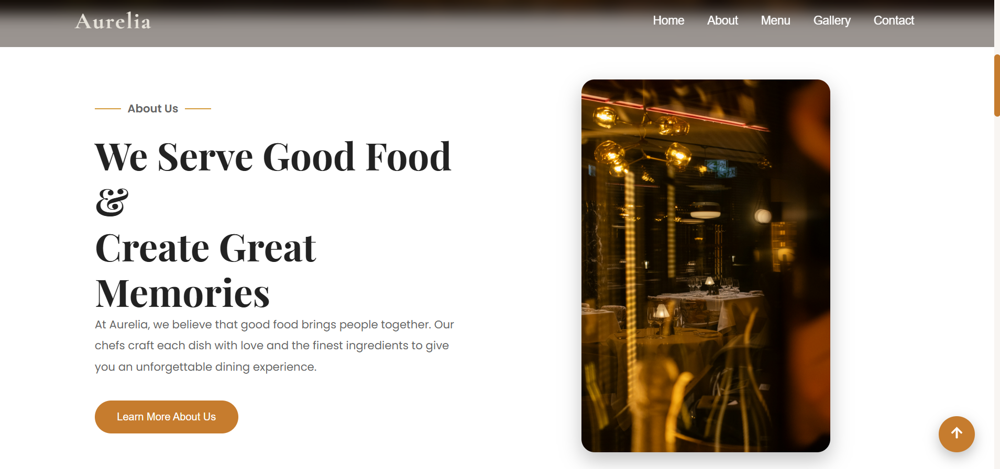
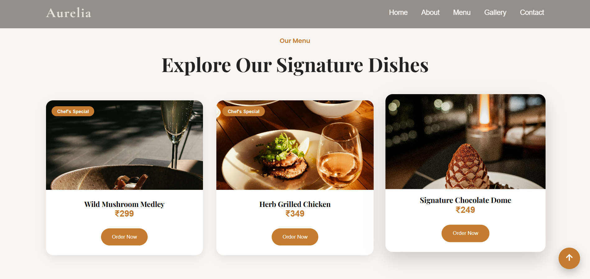
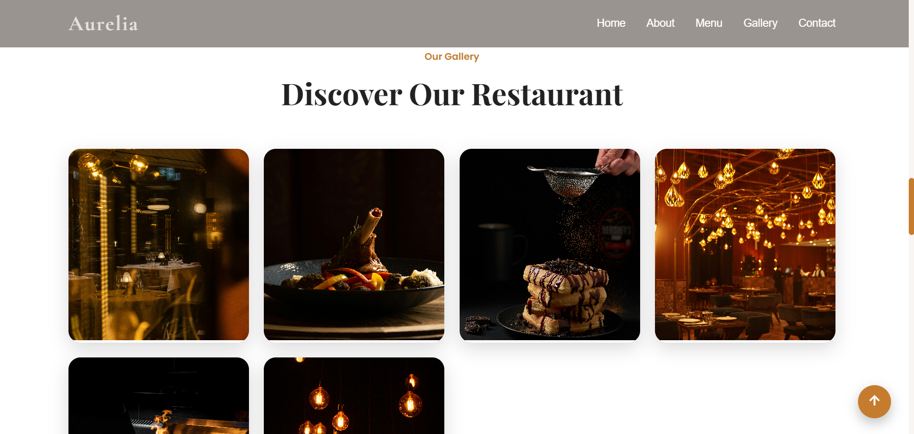
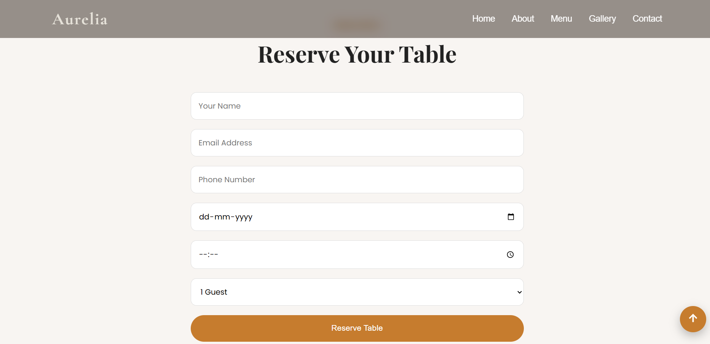

<div align="center">

# ✨ AURELIA

### Luxury Fine Dining Restaurant Website

Experience elegance, exceptional cuisine, and unforgettable dining moments through a beautifully crafted modern restaurant website.

<br>

[]()
[]()
[]()
[]()
[]()

### 🌐 Live Demo

https://aurelia-fine-dining.vercel.app/

</div>

---

# 🍽 About The Project

**Aurelia** is a premium fine dining restaurant website designed with a modern luxury aesthetic.

Inspired by elegant restaurant experiences, the website focuses on beautiful typography, immersive imagery, smooth navigation, and responsive design to provide visitors with an exceptional browsing experience.

The project was built using **React**, **Vite**, and modern CSS techniques with a strong emphasis on clean UI, responsiveness, and user experience.

---

# ✨ Features

✔ Elegant Landing Page

✔ Luxury Hero Section

✔ Responsive Navigation Bar

✔ About Section

✔ Signature Menu

✔ Interactive Gallery

✔ Reservation Section

✔ Contact Section

✔ Footer

✔ Back To Top Button

✔ Responsive Design

✔ Premium Typography

✔ Smooth Scrolling

✔ Luxury Branding

---

# 🛠 Tech Stack

| Technology | Purpose            |
| ---------- | ------------------ |
| React      | Frontend Framework |
| Vite       | Build Tool         |
| JavaScript | Application Logic  |
| CSS3       | Styling            |
| HTML5      | Structure          |
| Git        | Version Control    |
| GitHub     | Repository Hosting |
| Vercel     | Deployment         |

---

# 📁 Folder Structure

```text
Aurelia/
│
├── public/
│
├── screenshots/
│
├── src/
│   │
│   ├── assets/
│   │
│   ├── components/
│   │     Navbar
│   │     Hero
│   │     About
│   │     Menu
│   │     Gallery
│   │     Reservation
│   │     Contact
│   │     Footer
│   │     BackToTop
│   │
│   ├── styles/
│   │
│   ├── App.jsx
│   └── main.jsx
│
├── package.json
└── vite.config.js
```

---

# 📸 Website Preview

## 🏠 Hero Section



---

## 🍽 About



---

## 🍝 Signature Menu



---

## 📷 Gallery



---

## 📅 Reservation



---

# 🚀 Installation

Clone the repository

```bash
git clone https://github.com/Namita-12/aurelia-fine-dining.git
```

Navigate into the project

```bash
cd aurelia-fine-dining
```

Install dependencies

```bash
npm install
```

Run the development server

```bash
npm run dev
```

---

# 🎯 Future Enhancements

- Online Reservation System
- Food Ordering
- Customer Reviews
- Authentication
- Dark Mode
- Payment Integration
- Admin Dashboard
- Backend Integration

---

# 📱 Responsive Design

Designed for

- Desktop
- Laptop
- Tablet
- Mobile

---

# 💻 Developer

## Namita Naik

Computer Science Engineering Student

Frontend Developer | React Enthusiast | UI/UX Learner

### GitHub

https://github.com/Namita-12

### LinkedIn

www.linkedin.com/in/namita-naik

---

# ⭐ Show Your Support

If you enjoyed this project,

⭐ Star the repository

🍴 Fork the project

💙 Share your feedback

---

<div align="center">

## ✨ Aurelia

### Where Culinary Art Meets Elegance

Made with ❤️ using React & Vite

</div>
